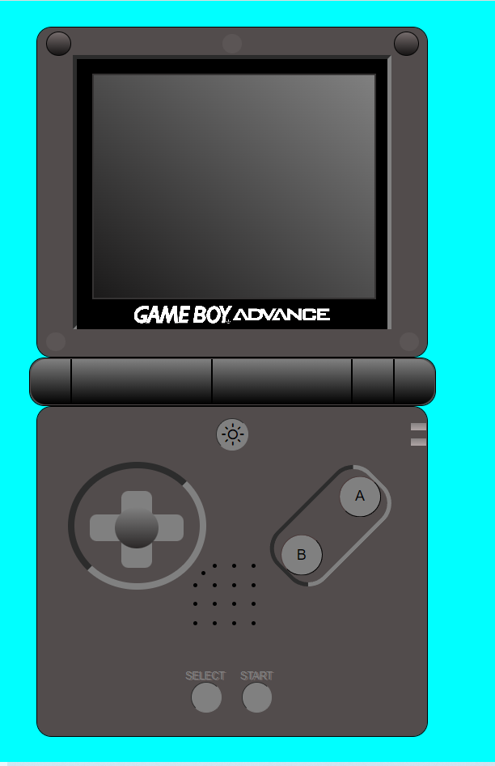
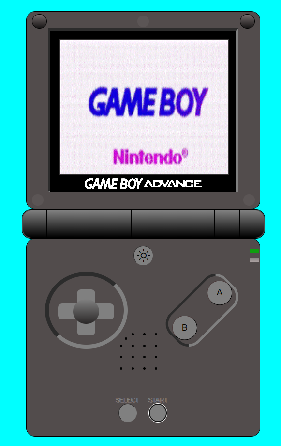
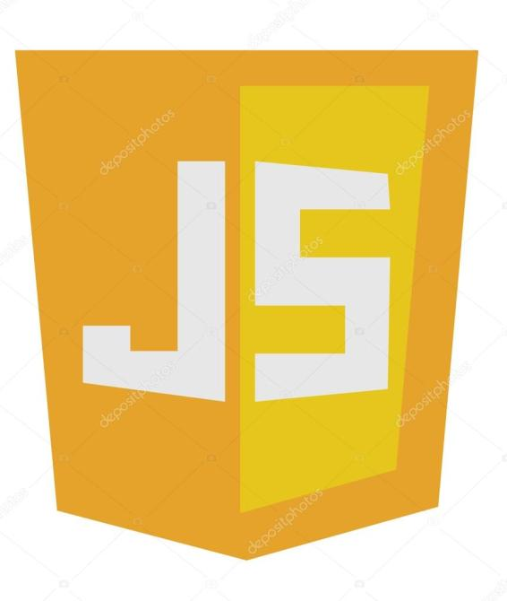
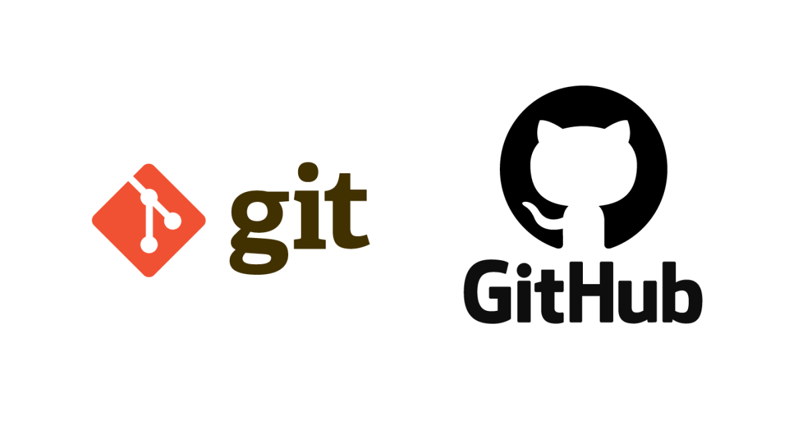

## GameBoy Advance SP

👋 Soy Javier Moya. 
💻 Soy un FullStack Developer en <kbd>⇥</kbd>  

### Sobre el proyecto

Este proyecto consiste en reproducir la imagen frontal de una videoconsola🎮. En este caso, es una GameBoy Advance SP.

Para empezar, podemos ver la imagen frontal de la GameBoy Advance SP:

Ahora podemos ver el frontal de la consola cuando hacemos click en el botón de START.
Podemos ver que se reproduce un GIF y además se enciende la luz verde de la derecha(luz de encendido).

Seguidamente, observamos que cuando hacemos click en el botón de SELECT, la consola vuelve a su estado inicial.

### Elaborado con:

Para este proyecto, estas son las tecnologías que han sido utilizadas:
 

 

Puedes ver este proyecto en <kbd>⇥</kbd> [GitHub pages](https://javiermoyasimo.github.io/project01-console/ "GitHub pages")

### Créditos

Autor: JavierMoyaSimo

Última vez editado: 25/09/2022
